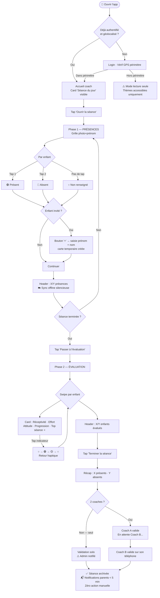
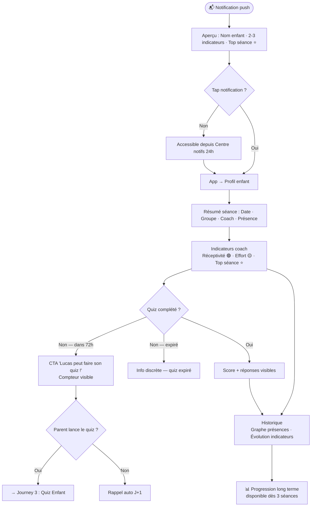
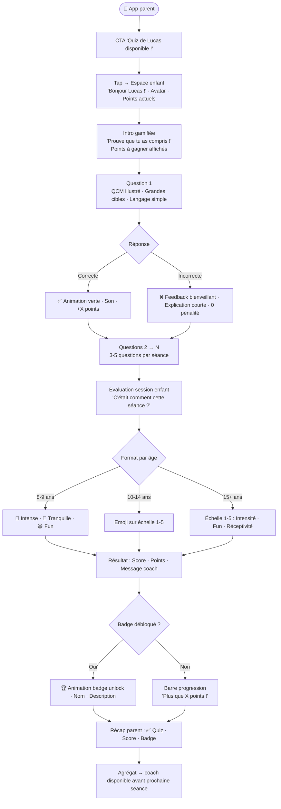
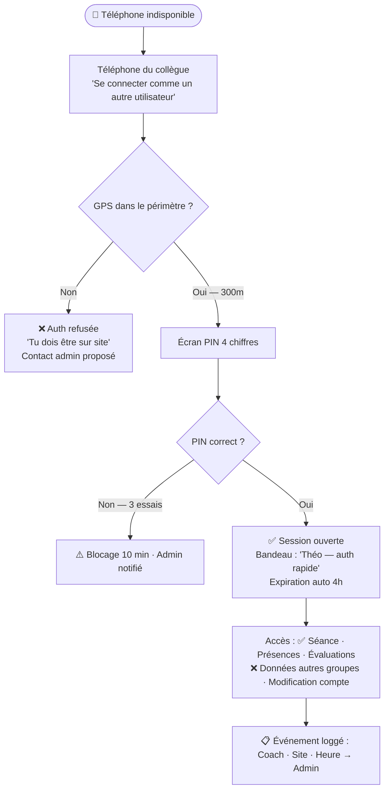

# UX Design Specification Application Aureak

**Author:** Jeremydevriendt
**Date:** 2026-03-03

---

<!-- UX design content will be appended sequentially through collaborative workflow steps -->

---

## Executive Summary

### Project Vision

AUREAK est une plateforme mobile (React Native, iOS + Android, offline-first) qui prolonge la séance de gardien de but au-delà du terrain. Elle connecte trois acteurs — coach, enfant, parent — dans un flux continu : check-in → évaluation terrain → quiz maison → progression visible. L'identité visuelle est premium, sportive, style futuriste manga (noir / or / beige), conçue pour un usage terrain réel avec une seule main.

### Target Users

**Coaches (primaires — contexte terrain)**
- Coach assistant (18 ans) et coach senior (34 ans)
- Usage une main, en mouvement, offline obligatoire
- Priorité absolue : vitesse et fiabilité (< 60s par enfant pour le check-in + évaluation)
- Feedback en fin de séance : 5 indicateurs par enfant (réceptivité, goût à l'effort, attitude, progression technique, top séance)

**Parents (secondaires — contexte maison)**
- Notification post-séance dans les 5 minutes suivant la validation coach
- Résumé concis : présence + état + indicateurs comportementaux sélectionnés
- Tableau de bord simple, accès au profil de l'enfant

**Enfants (4 segments, 8-18+ ans)**
- Accès via appareil parent jusqu'à 15-16 ans
- Quiz post-séance engageant et adapté à l'âge (grandes cibles, langage simple, feedback visuel)
- Boucle progression : quiz → badge débloqué → exercice filmé (phases futures)

**Admin / Responsable de site**
- Vue agrégée sur les présences, qualité coaching, indicateurs par implantation

### Key Design Challenges

1. **Interface une main / contexte terrain** — Toutes les interactions coach doivent être accessibles au pouce, sans popup, navigation verticale simple, grandes zones tactiles.
2. **Multi-persona, multi-contexte radical** — Coach en mouvement, parent sur canapé, enfant de 8 ans : trois UX fondamentalement différentes dans une même app.
3. **Offline-first visible et rassurant** — État de synchronisation communiqué clairement sans anxiété. Zéro perte de données silencieuse.
4. **Expérience enfant adaptée à l'âge** — Quiz adapté par segment (U5 à senior), feedback immédiat visuel/émotionnel, contrôle parental naturel.
5. **Modèle RGPD invisible** — Permissions enfant/parent appliquées automatiquement selon l'âge déclaré, sans gestion manuelle visible.

### Design Opportunities

1. **Identité "sports manga premium"** — Noir / or / beige + style futuriste = différenciation visuelle forte dans un marché EdTech sportif générique.
2. **La notification post-séance comme signature** — Premier point de contact parent après chaque séance, conçu comme moment de marque soigné.
3. **Flow coach ultra-rapide comme avantage compétitif** — < 30 secondes par enfant pour l'évaluation de fin de séance. La vitesse est la valeur UX n°1 pour le coach.
4. **Progression enfant comme achievement system** — Boucle quiz → badge → vidéo conçue pour créer un attachement émotionnel à la marque AUREAK.

---

## Design Decisions Log

> Décisions UX prises en cours de workflow. Ces règles s'appliquent à toutes les étapes suivantes.

---

### DD-01 — Indicateurs d'évaluation coach (Mode Séance)

**Date :** 2026-03-03
**Statut :** ✅ Validé

#### Règle d'interaction

Chaque indicateur d'évaluation (ex. goût à l'effort, réceptivité, attitude) suit un cycle à **2 états maximum** :

| État | Interaction | Visuel | Signification |
|---|---|---|---|
| **Par défaut** | Aucun tap | — (vide / neutre) | Aucune information envoyée |
| **État 1** | Tap 1 | 🟢 Positif | Signal positif transmis au parent |
| **État 2** | Tap 2 | 🟡 Point d'attention | Signal d'attention transmis au parent |
| ~~**État 3**~~ | ~~Tap 3~~ | ~~🔴~~ | ~~Supprimé~~ |

#### Règles UX associées

- Aucun indicateur n'est obligatoire — le coach peut valider une séance sans avoir renseigné un seul indicateur.
- Aucun état rouge n'existe dans le système.
- La logique de **triple tap est supprimée** définitivement.
- Chaque indicateur doit être évaluable en **maximum 2 interactions** (tap 1 ou tap 2).
- Le flow complet d'évaluation par enfant doit être réalisable en **moins de 10 secondes**.
- L'interface doit être utilisable **à une main** (pouce), sans popup, sans navigation latérale.

#### Indicateurs concernés (Mode Séance — évaluation par enfant)

Ces 5 indicateurs suivent tous la même logique 🟢 / 🟡 / vide :

| # | Indicateur | Type |
|---|---|---|
| 1 | Réceptivité | Comportemental |
| 2 | Goût à l'effort | Comportemental |
| 3 | Attitude | Comportemental |
| 4 | Progression technique | Technique |
| 5 | Top séance | Signal fort (distinction) |

**Hors de cette logique — champs séparés :**
- **Présences** : gestion dédiée (check-in avant/pendant séance)
- **Blessures** : champ séparé avec logique propre (déclaration, notification immédiate)

#### Impact sur le design

- Les 5 indicateurs sont affichés simultanément par enfant — le coach balaie et tape ce qui est pertinent, ignore le reste.
- Composants : toggles à cycle court (○ → 🟢 → 🟡 → ○), pas de sliders ou selects.
- **"Top séance" est une exception** : cycle binaire uniquement (○ → ⭐ → ○), pas d'état 🟡. C'est une distinction, pas une évaluation graduée. Traitement visuel distinct (étoile ⭐, couleur or) pour le différencier des 4 autres indicateurs.
- Zones tactiles larges (minimum 44×44pt, Apple HIG / Material).
- Retour haptique ou visuel immédiat à chaque tap pour confirmer l'état sans ambiguïté.
- L'état vide doit être visuellement distinct des états actifs — pas de confusion possible.

---

## Core User Experience

### Defining Experience

L'interaction qui définit AUREAK est le **flow de fin de séance coach** : évaluer chaque enfant en moins de 10 secondes, valider à deux, et déclencher automatiquement la notification parent dans les 5 minutes. C'est le moment où terrain, data et pédagogie convergent en un seul geste.

### Platform Strategy

- **Plateforme** : React Native — iOS + Android, expérience native hybride
- **Mode offline-first obligatoire** : toutes les données saisies sur le terrain sont sauvegardées localement et synchronisées dès que la connexion est rétablie
- **Usage principal coach** : une main, pouce, en mouvement — zéro popup, navigation verticale/swipe, grandes zones tactiles (min. 44×44pt)
- **Usage parent** : consultation passive, notifications push, tableau de bord simple
- **Usage enfant** : quiz gamifié, accessible sur l'appareil du parent jusqu'à 15-16 ans

### Session Flow Architecture

**Pré-session (Admin ou Coach responsable)**
- Configuration des séances à l'avance : date, horaire, groupe, liste enfants pré-remplie
- Le coach ouvre "la séance du jour" et voit directement son groupe

**Phase 1 — Présences** (avant / pendant la séance)
- Grille d'enfants : photo + nom + prénom
- Interaction par card : ○ = inconnu | tap 1 = 🟢 Présent | tap 2 = 🔴 Absent
- Ajout d'enfants invités possible (non inscrits — rattachés au compte plus tard)
- Modifications possibles jusqu'à la validation finale

**Phase 2 — Évaluation** (fin de séance)
- Même card enfant : 1/3 bas = statut présence | 2/3 = 5 indicateurs
- Navigation : swipe gauche/droite entre les enfants
- Tap sur un enfant → profil détaillé : thèmes de la séance + historique corrections
- Indicateurs : Réceptivité / Goût à l'effort / Attitude / Progression technique / Top séance ⭐

**Validation & Push**
- Écran récapitulatif → les deux coaches confirment (chacun sur son téléphone)
- Notification parent envoyée automatiquement après double validation
- Si un seul coach disponible : validation solo possible — l'admin est notifié que la double validation n'a pas eu lieu

### Multi-Coach Synchronisation

- **Présences** : partagées — le premier à remplir définit la donnée, l'autre peut corriger
- **Évaluations** : indépendantes par coach — en cas de conflit, la valeur la plus prudente l'emporte (🟡 Attention > 🟢 Positif)
- **Top séance ⭐** : logique OR — si l'un des deux coaches l'accorde, l'enfant l'obtient
- **Présence des coaches** : chaque coach valide sa propre présence à la séance (utilisé pour le suivi de rémunération)

### Authentication & Trust at Scale

- **Auth normale** : login classique sur son propre téléphone
- **Auth rapide** (batterie morte, téléphone oublié) : PIN 4 chiffres sur le téléphone d'un collègue — conditionné à la présence géolocalisée dans le périmètre de l'implantation (GPS offline-compatible)
- **Garde-fou anti-fraude** : le téléphone doit être physiquement sur le site pour déverrouiller ou modifier une séance
- **Dashboard admin** : chaque auth rapide est loguée (coach, implantation, heure)
- **Rayon configurable** par implantation (défaut : 300m, ajustable pour les salles couvertes à signal GPS faible)

### Effortless Interactions

- La liste d'enfants est **toujours pré-remplie** — le coach ne saisit jamais un nom
- La notification part **automatiquement** — le coach ne pense pas à "envoyer"
- L'état de sync est visible mais **non intrusif** — une icône discrète, pas une alerte
- Les thèmes de la séance sont **déjà dans la fiche enfant** — le coach ne cherche pas

### Critical Success Moments

- **Coach** : premier soir où il ferme son téléphone après la séance sans avoir envoyé un seul message WhatsApp — tout est déjà parti, automatiquement
- **Parent** : recevoir la notification dans les 5 minutes avec "Goût à l'effort ✅" et "Top séance ⭐" pour son enfant — l'approbation du coach, noir sur blanc
- **Enfant** : voir son avatar progresser après avoir complété le quiz dans les 72h — la boucle terrain → maison → points est fermée, et il le voit

### Experience Principles

1. **Vitesse d'abord** — Chaque interaction coach doit être plus rapide que l'alternative actuelle (WhatsApp, mémorisation, papier). Si ce n'est pas le cas, c'est un échec UX.
2. **Zéro perte de données** — Le coach ne doit jamais se demander "est-ce que c'est sauvegardé ?". L'app sauvegarde toujours, partout, même sans connexion.
3. **Une seule main suffit** — Toute interaction critique est réalisable au pouce, sans déposer le téléphone, sans rotation d'écran, sans popup.
4. **L'automatisme comme signature** — Ce que le coach ne fait pas manuellement (notification, sync, pré-remplissage) est ce qui crée la valeur perçue d'AUREAK.
5. **La progression visible crée l'engagement** — Enfant, parent et coach doivent tous avoir un indicateur visuel que "quelque chose avance" à chaque session.

---

## Desired Emotional Response

### Primary Emotional Goals

| Persona | Émotion dominante | Phrase signature |
|---|---|---|
| **Coach** | Soulagement + Compétence + Reconnaissance | *"Tout est fait. Mon travail compte."* |
| **Parent** | Fierté + Confiance | *"Mon enfant est entre de bonnes mains, et je le vois."* |
| **Enfant** | Appartenance + Motivation | *"Je progresse. Je fais partie de quelque chose."* |
| **Admin** | Maîtrise + Confiance opérationnelle | *"Je sais exactement ce qui se passe."* |

### Emotional Journey Mapping

**Coach — de la surcharge à la maîtrise**
- *Avant la séance* : Confiance — la fiche séance est prête, les thèmes sont là
- *Pendant la séance* : Focus — une seule app, tout au même endroit
- *Fin de séance* : Soulagement — évaluation en 10 sec/enfant, push automatique
- *J+1* : Reconnaissance — il voit le retour agrégé des enfants sur sa séance (intensité perçue, fun, réceptivité) et mesure son impact réel

**Parent — de l'invisibilité à la connexion**
- *Notification reçue* : Surprise positive — dans les 5 min, sans demander
- *Lecture des indicateurs* : Fierté — "Top séance ⭐ — Goût à l'effort ✅"
- *Consultation du profil* : Confiance — progression visible dans le temps
- *Retour à l'app* : Habitude — chaque séance renforce la relation avec AUREAK

**Enfant — de la participation à l'appartenance**
- *Entrée dans l'app* : Plaisir — c'est un jeu, pas un devoir
- *Quiz complété < 72h* : Satisfaction + Anticipation — points gagnés, avatar progresse
- *Badge débloqué* : Fierté — reconnaissance visible, partageable
- *Retour coach visible* : Validation — le coach m'a vu, mon effort compte
- *Avatar qui monte* : Appartenance — j'ai une identité AUREAK qui se construit

**Admin — du flou au contrôle**
- *Dashboard ouvert* : Clarté — tout est agrégé, rien ne manque
- *Anomalie détectée* : Confiance — l'app l'a signalé avant qu'il cherche
- *Rapport saison* : Maîtrise — les données prouvent la qualité de la méthode

### Micro-Emotions by Design

| Émotion cible | Émotion à éviter | Décision UX |
|---|---|---|
| **Confiance** (coach) | Anxiété de perte de données | Indicateur sync discret, toujours visible |
| **Fluidité** (coach terrain) | Frustration de navigation | Zéro popup, swipe naturel, une main |
| **Fierté** (parent) | Indifférence | Notification soignée, pas un simple SMS |
| **Excitement** (enfant) | Ennui / obligation | Gamification visible, feedback immédiat |
| **Reconnaissance** (coach) | Invisibilité du travail | Retour agrégé enfants → coach après chaque séance |
| **Appartenance** (coach) | Isolement | Dimension communautaire : stats académie, top coachs |

### Bidirectional Recognition Loop

La découverte clé de cette étape : AUREAK ne mesure pas seulement **l'enfant vu par le coach** — elle mesure aussi **la séance vue par l'enfant**.

```
Coach évalue l'enfant (5 indicateurs)
         ↕
Enfant évalue la séance (1-2 questions adaptées à l'âge)
         ↓
Agrégat groupe → visible par le coach → reconnaissance + amélioration
```

Format adapté par âge :
- **8-9 ans** : Choix d'animaux (lion = intense, tortue = tranquille)
- **10-14 ans** : Personnages / emoji sur une échelle visuelle
- **15+ ans** : Échelle d'intensité simple (1 à 5)

Dimensions évaluées : Intensité de la séance / Réceptivité ressentie / Fun

### Tone by Persona

- **Coach** : Professionnel, efficace, sobre — pas d'infantilisation
- **Parent** : Chaleureux, rassurant, concis — pas de jargon technique
- **Enfant 8-9 ans** : Fun, couleurs, animaux — c'est un jeu avant tout
- **Enfant 10-14 ans** : Mix ludique + aspirationnel — je progresse ET je m'amuse
- **Enfant 15+** : Sérieux et aspirationnel avec des accents de compétition

### Emotional Design Principles

1. **La reconnaissance est un moteur de rétention** — Coach, enfant et parent doivent tous recevoir un signal que leur action a été vue et compte.
2. **Le fun est la porte d'entrée, la progression est la raison de rester** — L'enfant entre par le jeu, reste pour voir son avatar grandir.
3. **La fierté parentale est un vecteur de bouche-à-oreille** — Une notification bien conçue avec "Top séance ⭐" est plus puissante qu'une campagne marketing.
4. **L'émotion négative à éviter absolument côté coach : la perte de données** — Un seul incident de données perdues détruirait la confiance durablement.
5. **La communauté crée l'engagement long terme** — Le coach qui se sent appartenir à quelque chose de plus grand que sa séance reste et s'investit.

---

## UX Pattern Analysis & Inspiration

### Inspiring Products Analysis

#### Clash Royale — Manga card design + feedback immédiat

**Ce qui fonctionne exceptionnellement :**
- **Cards de personnages** : chaque card est une unité d'information dense (illustration + nom + stats) lisible en un coup d'œil — parfait pour les fiches enfants dans le Mode Séance
- **Feedback visuel instantané** : chaque interaction a une réponse animée immédiate — aucun doute sur ce qui vient de se passer
- **Progression visible à tout moment** : niveau, XP, coffrets à venir — l'utilisateur sait toujours où il en est
- **Esthétique manga illustrée** : personnages expressifs, couleurs riches sur fond sombre, lisibilité parfaite sur mobile
- **Navigation ultra-rapide** : bottom nav 4-5 items, zéro nesting profond

**À transférer sur AUREAK :**
- Format card pour les enfants (photo + nom + indicateurs)
- Feedback haptique/visuel immédiat sur chaque tap d'indicateur
- Barre de progression avatar visible depuis le profil enfant
- Style illustration manga pour les badges et avatars

---

#### FIFA / EA FC — UI sport premium + données structurées

**Ce qui fonctionne exceptionnellement :**
- **Cards joueur FUT** : dark background, accents or, stats alignées — exactement l'esthétique AUREAK cible
- **Dashboard stats** : présentation claire de données chiffrées sans surcharge
- **Écrans de résumé post-match** : MOTM, stats clés, retour visuel rapide — structure proche du résumé post-séance AUREAK
- **Hiérarchie visuelle forte** : l'info principale toujours au premier plan, les détails accessibles en tap

**À transférer sur AUREAK :**
- Style card joueur pour les profils enfant (fond sombre, accent or)
- Structure écran résumé post-séance inspirée du résumé post-match
- Traitement visuel "Man of the Match" → "Top séance ⭐" AUREAK
- Palette noir / or / beige directement issue de l'esthétique FUT premium

---

#### Site aureak.be + illustrations manga existantes — Identité propriétaire

**Palette existante :** blanc dominant, beige/crème (#F3EFE7), zinc gris
**Style illustrations :** manga expressif avec speedlines radiales, personnages en action dynamique sur fond beige/crème — référence visuelle directe pour le style graphique de l'app

**Relation site → app :**
Le site est la vitrine professionnelle. L'app est l'espace immersif.
→ Le beige/crème du site devient un accent warm dans l'app sombre.
→ Le style manga des illustrations existantes définit l'univers graphique cible.

### Transferable UX Patterns

**Patterns de navigation**
- **Bottom nav fixe 4-5 items** (Clash Royale, FIFA) → adapté par rôle connecté (coach / parent / enfant)
- **Swipe horizontal entre items** (Clash Royale) → navigation entre enfants dans le Mode Séance
- **Accès direct "séance du jour"** depuis l'écran d'accueil coach — zéro navigation

**Patterns d'interaction**
- **Card tap avec feedback immédiat** (Clash Royale) → indicateurs d'évaluation avec animation + retour haptique
- **Swipe-to-confirm** (iOS natif) → validation de séance coach
- **Progressive disclosure** (FIFA) → fiche enfant : résumé visible, détails en tap

**Patterns de progression & gamification**
- **XP bar + level up** (Clash Royale) → avatar enfant avec barre de progression
- **Card unlock animation** (Clash Royale) → badge AUREAK débloqué avec animation récompense
- **MOTM highlight** (FIFA) → "Top séance ⭐" mis en avant dans la notification parent

**Patterns visuels**
- **Fond sombre + accents lumineux** (FIFA FUT, Clash Royale) → lisibilité terrain optimale, ambiance premium
- **Illustrations manga expressives** (Clash Royale + univers AUREAK existant) → avatars enfants, badges, icônes
- **Cards arrondies** (aureak.be) → cohérence avec l'identité existante

### Anti-Patterns to Avoid

- **Navigation profonde multi-niveaux** (FIFA mode carrière) — le coach ne peut pas se perdre dans 4 niveaux pendant une séance
- **Mécanique pay-to-win / FOMO agressif** (Clash Royale pass) — la gamification AUREAK doit motiver, pas frustrer
- **Notifications en rafale** (jeux mobile génériques) — maximum 1 notification post-séance, soignée et pertinente
- **Onboarding trop long** — le coach doit faire sa première séance sans tutoriel de 10 étapes
- **Données sans contexte** (tableaux bruts) — chaque chiffre doit avoir une signification immédiatement compréhensible

### Design Inspiration Strategy

**À adopter directement :**
- Format card enfant style FUT (fond sombre, photo, nom, indicateurs alignés)
- Navigation swipe horizontal entre enfants pendant l'évaluation
- Barre de progression + animation niveau pour l'avatar enfant
- Palette noir / or / beige — le beige du site comme couleur warm accent

**À adapter pour AUREAK :**
- Le "chest opening" Clash Royale → badge unlock : garder l'anticipation sans la mécanique aléatoire (le badge est mérité, pas tiré au sort)
- Le résumé post-match FIFA → résumé post-séance : adapté pour 3 personas (coach : agrégat groupe / parent : son enfant / enfant : son résultat)
- Les illustrations manga → univers AUREAK propre (gardien de but, pas guerrier fantastique)

**À éviter pour rester AUREAK :**
- Aucun mécanisme aléatoire — la progression est méritocratique et pédagogique
- Pas de comparaison inter-enfants visible côté parent/enfant — la progression est personnelle
- Pas de dark patterns de rétention (streaks punitifs, vies limitées) — l'engagement doit être positif

---

## Design System Foundation

### Design System Choice

**Système retenu : Tamagui + Expo Router**
Architecture universelle — un seul codebase pour mobile (iOS/Android)
et web, avec maximum de logique métier partagée.

**Stack :** Expo Router (routing universel) + Tamagui (UI mobile + web) + Monorepo (packages partagés)

### Architecture Universelle

```
apps/
  mobile/         → Expo (iOS + Android) — offline-first, terrain
  web/            → Expo Router web — parents, admin, coach bureau

packages/
  ui/             → Composants Tamagui partagés
  business-logic/ → Règles métier, calculs, validation (100% partagé)
  api-client/     → Appels Supabase (100% partagé)
  types/          → TypeScript types communs
  theme/          → Design tokens AUREAK
```

### Surfaces par Persona

| Persona | Surface principale | Surface secondaire |
|---|---|---|
| **Coach terrain** | Mobile (offline-first) | Web (préparation bureau) |
| **Parent** | Web (dashboard) | Mobile (consultation rapide) |
| **Enfant** | Mobile (quiz, avatar) via parent | Web phase 2 |
| **Admin** | Web (dashboard complet) | Mobile (vue rapide) |

### Design Tokens AUREAK — Palette officielle (source : aureak.be)

```ts
// packages/theme/tokens.ts

export const colors = {
  // Fonds app (dark — inversé par rapport au site)
  background: {
    primary : '#1A1A1A',  // noir chaud — fond principal app (issu du logo)
    surface : '#171717',  // surfaces — cards, listes
    elevated: '#242424',  // modals, overlays, drawers
  },

  // Accents AUREAK — valeurs extraites directement de aureak.be
  accent: {
    gold  : '#C1AC5C',  // or champagne AUREAK — confirmé logo + site
    beige : '#F3EFE7',  // beige/crème — warm accent, cohérence site
    zinc  : '#424242',  // zinc gris — éléments secondaires
  },

  // États fonctionnels
  status: {
    present  : '#4CAF50',  // présent 🟢 / évaluation positive
    attention: '#FFC107',  // point d'attention 🟡
    absent   : '#F44336',  // absent 🔴 — présences uniquement
  },

  // Texte
  text: {
    primary  : '#FFFFFF',
    secondary: '#A0A0A0',
    dark     : '#171717',  // sur fond beige/blanc — cohérence site web
  },
}

export const fonts = {
  family: 'Geist',       // identique au site aureak.be
  mono  : 'Geist Mono',
}

export const space = {
  xs: 4, sm: 8, md: 16, lg: 24, xl: 32, xxl: 48,
}

export const radius = {
  card  : 16,
  button: 12,
  badge : 999,
}
```

### Composants Critiques MVP

| Composant | Mobile | Web | Priorité |
|---|---|---|---|
| `ChildCard` | ✅ Swipeable | ✅ Grid view | 🔴 Critique |
| `IndicatorToggle` | ✅ Haptic | ✅ Click | 🔴 Critique |
| `StarToggle` | ✅ | ✅ | 🔴 Critique |
| `SessionHeader` | ✅ Compact | ✅ Expanded | 🔴 Critique |
| `AureakNotification` | ✅ Push native | ✅ In-app | 🔴 Critique |
| `AvatarCard` | ✅ | ✅ | 🟡 Phase 2 |
| `BadgeCard` | ✅ | ✅ | 🟡 Phase 2 |

### Règles pour les agents de développement

1. **Jamais de valeur hardcodée** — toujours `colors.accent.gold`, jamais `#C1AC5C`
2. **Composant = une fois** — si présent dans `packages/ui`, importer, ne pas recréer
3. **Logique métier hors UI** — toujours dans `packages/business-logic`
4. **Platform-specific** — fichiers `.native.ts` / `.web.ts`, Expo résout automatiquement

---

## 2. Core User Experience

### 2.1 Defining Experience

**AUREAK en une phrase :**
> "La séance ne s'arrête pas quand l'enfant quitte le terrain."

**L'interaction définissante — Mode Séance coach :**
> "Swipe tes joueurs, tape leur performance, la notification part toute seule."

Comme Tinder réduit la mise en relation à un swipe, AUREAK réduit l'évaluation post-séance à un swipe + 1-2 taps par enfant. C'est cette vitesse qui crée l'adoption. Si le coach trouve ça plus rapide que WhatsApp dès le premier soir, tout le reste suit.

### 2.2 User Mental Model

**Modèle mental actuel du coach :**
- Liste de présences = feuille papier ou mémoire → WhatsApp en fin de séance
- Évaluation enfant = dans la tête, jamais formalisée, se perd après 3 groupes
- Retour parent = inexistant ou informel (discussion bord de terrain)

**Modèle mental cible (après AUREAK) :**
- "J'ouvre ma séance → mes joueurs sont déjà là"
- "Je tape présent/absent en arrivant → ça se souvient"
- "En fin de séance, je swipe chaque gamin et tape ce qui me frappe → envoyé"

**Points de friction à anticiper :**
- Premier usage : "où est ma séance du jour ?" → accès direct depuis l'accueil
- Doute sur la sauvegarde offline : "est-ce que c'est parti ?" → indicateur discret
- Résistance au changement : "c'était plus vite sur WhatsApp" → le flow doit battre WhatsApp en vitesse dès J1

### 2.3 Success Criteria

**Le flow est réussi quand :**
- ✅ Le coach complète la présence de 12 enfants en < 90 secondes
- ✅ Le coach évalue 12 enfants (5 indicateurs chacun) en < 3 minutes
- ✅ La notification parent part sans que le coach ait tapé "envoyer"
- ✅ Le coach n'a envoyé aucun message WhatsApp après la séance
- ✅ Un coach non formé comprend le flow en < 2 minutes sans tutoriel

**Signaux d'échec :**
- ❌ Le coach doit naviguer dans plus de 2 écrans pour atteindre sa séance
- ❌ Il y a une action "envoyer la notification" explicite à faire
- ❌ Un indicateur non renseigné bloque la validation de la séance
- ❌ La connexion internet est requise pour sauvegarder les présences

### 2.4 Novel vs. Established Patterns

**Patterns établis utilisés (familiers, zéro apprentissage) :**
- Swipe gauche/droite entre cards (Tinder, Duolingo) → navigation entre enfants
- Tap pour sélectionner un état (toggle natif mobile) → indicateurs
- Card avec photo + nom (contacts iOS/Android) → liste enfants
- Notification push → alerte parent post-séance

**Pattern semi-novel — l'IndicatorToggle :**
Le cycle ○ → 🟢 → 🟡 → ○ est nouveau mais auto-explicatif :
- Premier tap = vert = positif (réflexe naturel)
- Deuxième tap = jaune = attention (nuance)
- Troisième tap = retour à vide (annuler)

Enseignement sans tutoriel : micro-label sous le premier indicateur à J1 — "Tap = positif · Tap encore = à surveiller" — disparaît après 3 utilisations.

**Innovation principale — le déclenchement automatique :**
Le coach ne "publie" pas, ne confirme pas l'envoi. La notification part quand la double validation est faite. Rupture avec tous les outils existants (Spond, WhatsApp, TeamSnap).

### 2.5 Experience Mechanics

#### Flow complet Mode Séance — Coach

**1. Initiation**
```
Accueil coach
  └─ Card "Séance du jour" visible immédiatement (pas de navigation)
       Groupe · Horaire · Nombre d'enfants · Statut sync
  └─ Tap → ouverture de la séance
```

**2. Phase Présences** (avant / pendant)
```
Grille d'enfants (photo + prénom)
  ├─ ○  Tap 1 → 🟢 Présent   (bordure verte)
  ├─ 🟢 Tap 2 → 🔴 Absent    (bordure rouge)
  └─ 🔴 Tap 3 → ○  Inconnu

Ajout invité → bouton "+" → saisie prénom + nom → carte temporaire créée
Sync status → icône discrète en header (🟢 synced / ☁️ offline)
```

**3. Phase Évaluation** (fin de séance)
```
Card enfant (évaluation) :
  ┌─────────────────────────────┐
  │ [Photo]  Prénom NOM         │
  │ 🟢 Présent                  │
  ├─────────────────────────────┤
  │ Réceptivité      [ ○ ]      │
  │ Goût à l'effort  [ 🟢 ]     │
  │ Attitude         [ ○ ]      │
  │ Progression tech [ 🟡 ]     │
  │ Top séance       [ ○ ]      │
  └─────────────────────────────┘

Navigation : swipe G/D → enfant suivant / précédent
Feedback haptique : léger impact à chaque changement d'état
```

**4. Feedback en temps réel**
```
Header : "8/12 enfants évalués" → progression visible
Indicateur sync discret (offline = icône nuage, jamais d'alerte bloquante)
```

**5. Completion — Double validation**
```
Bouton "Terminer la séance"
  └─ Écran récap : X présents · Y absents · Z non renseignés
  └─ Coach A valide → statut "En attente de Coach B"
  └─ Coach B valide → push notifications parents envoyées automatiquement

Si Coach B indisponible → validation solo possible, admin notifié

Résultat automatique :
  ✅ Notification parent < 5 min
  ✅ Séance archivée
  ✅ Présences remontées à l'admin
```

---

## Visual Design Foundation

### Color System

**Palette sémantique complète — Application AUREAK**

```ts
// Fonds (dark theme — inspiré du logo)
background.primary  : #1A1A1A  // fond principal — noir chaud logo
background.surface  : #171717  // cards, listes
background.elevated : #242424  // modals, drawers, overlays

// Identité AUREAK (extraits logo + aureak.be)
accent.gold         : #C1AC5C  // or champagne — premium, Top séance ⭐
accent.beige        : #F3EFE7  // beige/crème — warm accent
accent.zinc         : #424242  // gris zinc — éléments secondaires
accent.ivory        : #F0EDE0  // blanc ivoire — texte sur fond sombre

// États fonctionnels
status.present      : #4CAF50  // présent 🟢 / évaluation positive
status.attention    : #FFC107  // point d'attention 🟡
status.absent       : #F44336  // absent 🔴 — présences uniquement

// Texte
text.primary        : #FFFFFF  // blanc pur — titres, labels clés
text.secondary      : #A0A0A0  // gris — info secondaire
text.dark           : #171717  // sur fond beige/blanc (web dashboard)
```

**Ratios de contraste — Conformité WCAG**

| Couleur | Fond | Ratio | Niveau |
|---|---|---|---|
| #FFFFFF (texte) | #1A1A1A | 16.1:1 | AAA ✅ |
| #C1AC5C (or) | #1A1A1A | 8.1:1 | AAA ✅ |
| #4CAF50 (vert) | #1A1A1A | 7.6:1 | AAA ✅ |
| #FFC107 (jaune) | #1A1A1A | 10.7:1 | AAA ✅ |
| #A0A0A0 (secondaire) | #1A1A1A | 7.2:1 | AA ✅ |
| #171717 (texte dark) | #F3EFE7 | 14.8:1 | AAA ✅ |

### Typography System

**Pairing retenu : Rajdhani (headings) + Geist (body)**

```ts
fonts: {
  display : 'Rajdhani',    // titres écrans, noms sections, stats clés
  heading : 'Rajdhani',    // H1, H2, H3
  body    : 'Geist',       // paragraphes, labels, descriptions
  mono    : 'Geist Mono',  // valeurs numériques, données tabulaires
}

typography: {
  display : { size: 36, weight: 700, font: 'Rajdhani', tracking: 0.5 },
  h1      : { size: 28, weight: 700, font: 'Rajdhani', tracking: 0.3 },
  h2      : { size: 22, weight: 600, font: 'Rajdhani', tracking: 0.2 },
  h3      : { size: 18, weight: 600, font: 'Rajdhani', tracking: 0.1 },
  bodyLg  : { size: 16, weight: 400, font: 'Geist', lineHeight: 1.5 },
  body    : { size: 15, weight: 400, font: 'Geist', lineHeight: 1.5 },
  bodySm  : { size: 13, weight: 400, font: 'Geist', lineHeight: 1.4 },
  caption : { size: 11, weight: 400, font: 'Geist', lineHeight: 1.3 },
  label   : { size: 12, weight: 600, font: 'Geist', tracking: 0.8, uppercase: true },
  stat    : { size: 24, weight: 700, font: 'Geist Mono', tabularNums: true },
}
```

**Cas d'usage clés :**
- Nom enfant sur card → `h3` Rajdhani #FFFFFF
- Nom indicateur → `label` Geist #A0A0A0 uppercase
- Points/score → `stat` Geist Mono #C1AC5C
- Description notification → `body` Geist #FFFFFF

### Spacing & Layout Foundation

**Unité de base : 8px**

```ts
space: { xs:4, sm:8, md:16, lg:24, xl:32, xxl:48, xxxl:64 }
radius: { card:16, button:12, badge:999 }
```

**Mobile (coach terrain) :**
- Colonne unique full-width · Gutters 16px
- Bottom tab navigation (5 tabs max)
- Zones tactiles minimum 44×44pt
- Actions critiques dans le tiers bas de l'écran (thumb zone)

**Web (admin / parent / coach bureau) :**
- Sidebar fixe 240px + contenu max-width 1200px
- Grid 4 colonnes (lg) / 2-3 (md) / 1 (sm)
- Cards padding 24px

**Densité par contexte :**
- Coach terrain → espacé, grandes cibles
- Dashboard admin → dense mais lisible
- Board parent → épuré, info enfant mise en valeur

### Accessibility Considerations

- Taille minimale texte : 11px — jamais en dessous sur mobile
- Zones tactiles : 44×44pt mobile / 32×32px web
- Toute la palette passe WCAG AA minimum
- États 🟢/🟡/🔴 toujours accompagnés d'icône ou label — jamais couleur seule
- Offline states : icône + texte, jamais uniquement couleur
- App dark-only mobile — site web reste light (vitrine publique)

---

## User Journey Flows

### Journey 1 — Mode Séance Coach (flow critique MVP)

**Contexte :** Marc arrive sur le terrain. La séance est pré-configurée par l'admin. Il doit faire les présences, coacher, évaluer, valider — sans WhatsApp.



---

### Journey 2 — Expérience Parent post-séance

**Contexte :** Sophie reçoit une notification dans les 5 minutes suivant la validation coach.



---

### Journey 3 — Quiz Enfant post-séance

**Contexte :** Lucas (12 ans, Foot à 8) fait son quiz sur le téléphone de sa mère dans les 72h après la séance.



---

### Journey 4 — Authentication Rapide Géolocalisée

**Contexte :** Théo a oublié son téléphone. Il utilise celui d'un collègue.



---

### Journey Patterns Extraits

**Navigation**
- **Accès direct** : séance du jour en 1 tap depuis l'accueil — jamais de navigation profonde
- **Swipe horizontal** : navigation entre enfants dans le mode évaluation — un enfant à la fois
- **Progressive disclosure** : résumé visible → détails en tap (profil enfant, historique indicateurs)

**Feedback & Confirmation**
- **Haptique immédiat** à chaque toggle d'indicateur — confirmation sans regarder l'écran
- **Pas de confirmation modale** — les états changent à la volée, la validation est en fin de flow
- **Compteur header** : "8/12 évalués" — progression visible en permanence

**Automatisme**
- **Zéro bouton "Envoyer"** — notification parent part automatiquement après double validation
- **Sync silencieuse** — icône ☁️ en header seulement, jamais de popup bloquant
- **Pré-remplissage constant** — liste enfants, thèmes, groupe toujours prêts à l'ouverture

**Sécurité invisible**
- **GPS transparent** — contrôle silencieux si coach sur site, visible seulement en cas d'échec
- **Expiration automatique** — sessions auth rapide expirent sans intervention manuelle
- **Logging passif** — événements enregistrés sans interrompre le flow coach

### Flow Optimization Principles

1. **< 3 taps vers l'action principale** — depuis l'accueil, présences accessibles en 2 taps max
2. **Jamais de cul-de-sac** — chaque état d'erreur (GPS hors périmètre, PIN incorrect) propose une sortie claire
3. **Happy path évident** — actions secondaires (invité, validation solo) jamais aussi saillantes que l'action principale
4. **Feedback multi-canal** — haptique + visuel : évaluation réalisable sans regarder activement l'écran
5. **Récupération sans perte** — si l'app se ferme en cours d'évaluation, l'état est restauré à la réouverture (offline-first garanti)

---

## Design Direction Decision

### Design Directions Explorées

Quatre directions ont été explorées dans le showcase HTML interactif (`ux-design-directions.html`) :

| # | Direction | Identité | Statut |
|---|---|---|---|
| 1 | **Dark Manga Premium** | Noir #1A1A1A · Or #C1AC5C · Beige #F3EFE7 · Rajdhani + Geist | ✅ Retenue |
| 2 | Clean Sport Light | Fond blanc · Accents bleu-gris · Sans-serif sport | ❌ Écarté |
| 3 | Neon Futuriste | Fond très sombre · Accents néon cyan/violet | ❌ Écarté |
| 4 | Warm Academy | Fond brun chaud · Teintes terracotta | ❌ Écarté |

### Direction Retenue

**Direction 1 — Dark Manga Premium**

Fond sombre (#1A1A1A), accents or champagne (#C1AC5C) et beige (#F3EFE7), typographie Rajdhani (headings) + Geist (body), style illustration manga futuriste. Expérience visuellement premium, lisibilité optimale sur terrain, cohérence totale avec l'identité AUREAK existante (logo, site, illustrations).

### Design Rationale

- **Cohérence logo** : le fond #1A1A1A est directement extrait du logo AUREAK — la continuité identitaire est immédiate
- **Lisibilité terrain** : le dark theme minimise l'éblouissement en plein air, maximise le contraste pour une lecture rapide à une main
- **Positionnement premium** : l'or champagne (#C1AC5C) signale une académie haut de gamme dès le premier écran, se différenciant radicalement des outils génériques (Spond, TeamSnap)
- **Univers manga cohérent** : les illustrations manga existantes sur aureak.be trouvent leur écrin naturel sur fond sombre — le beige devient un warm accent qui connecte app et vitrine
- **Gamification crédible** : le style FIFA FUT / Clash Royale sur fond sombre est le terrain naturel des avatars, badges et cards joueur — l'expérience enfant y est immédiatement à l'aise

### Implementation Approach

Tous les composants sont construits à partir des tokens `packages/theme/tokens.ts` déjà définis. Aucune valeur hardcodée autorisée. La direction Dark Manga Premium s'implémente par défaut — pas de light mode sur mobile. Le site web (vitrine publique) reste en light mode avec les mêmes tokens accent (gold, beige) sur fond blanc/crème pour la cohérence inter-surfaces.
